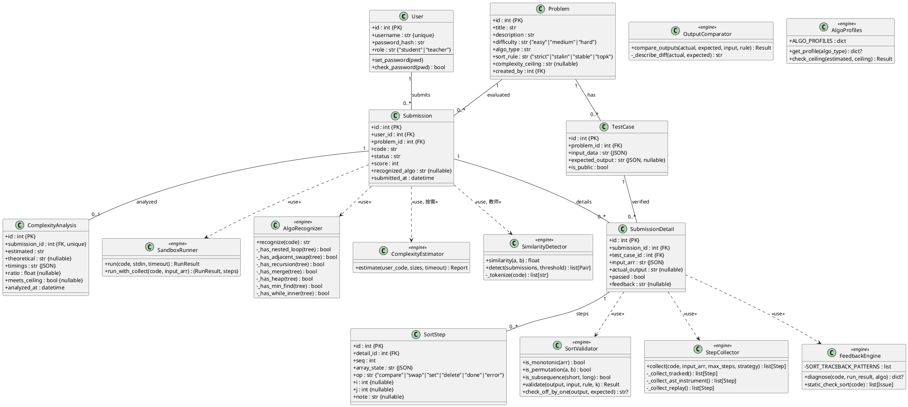
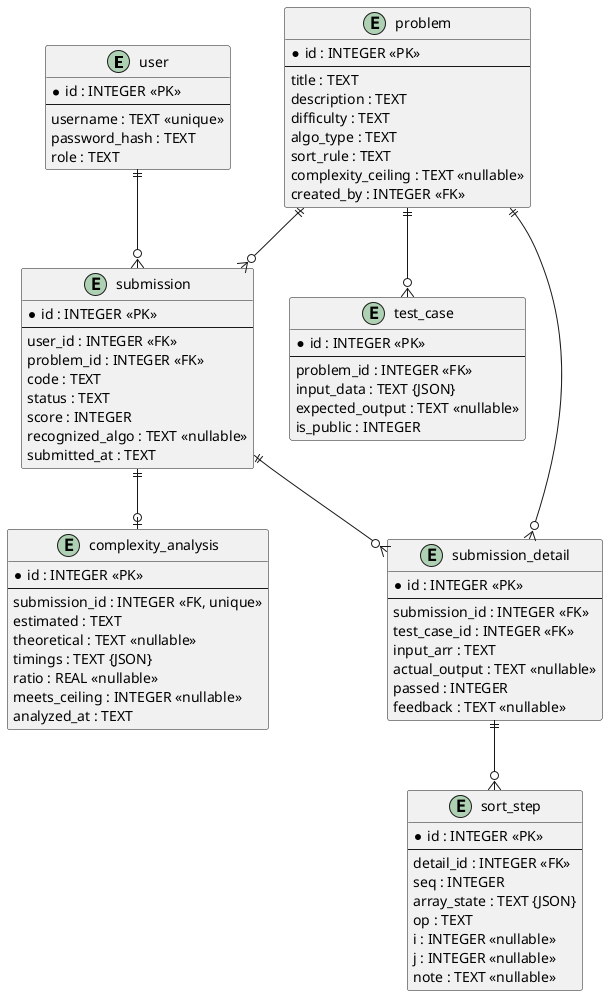
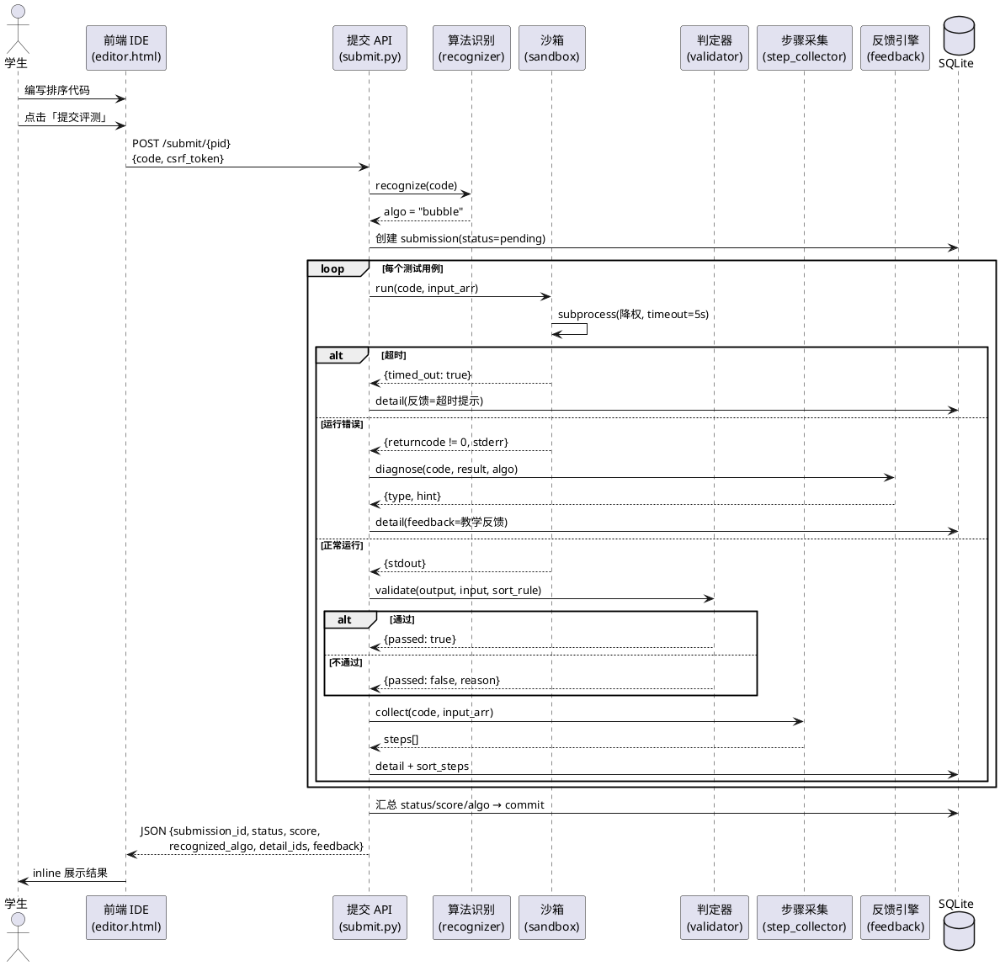
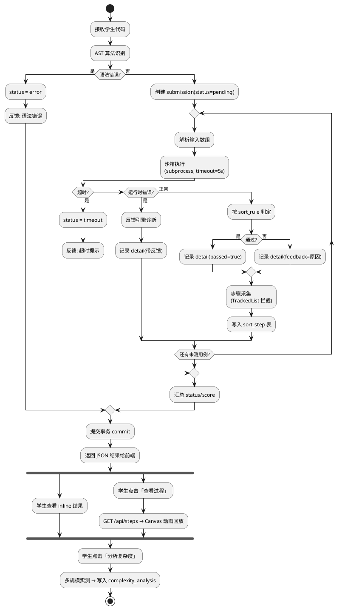
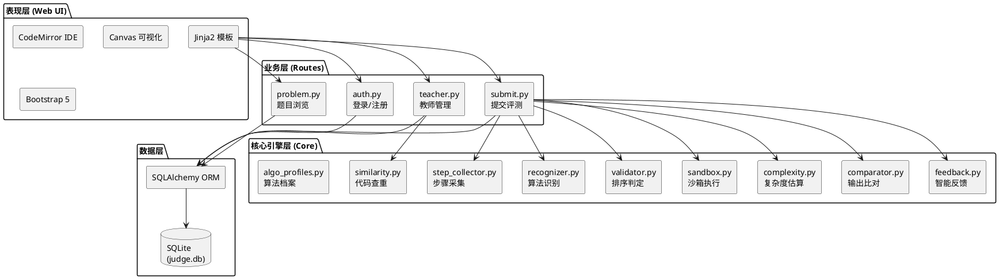
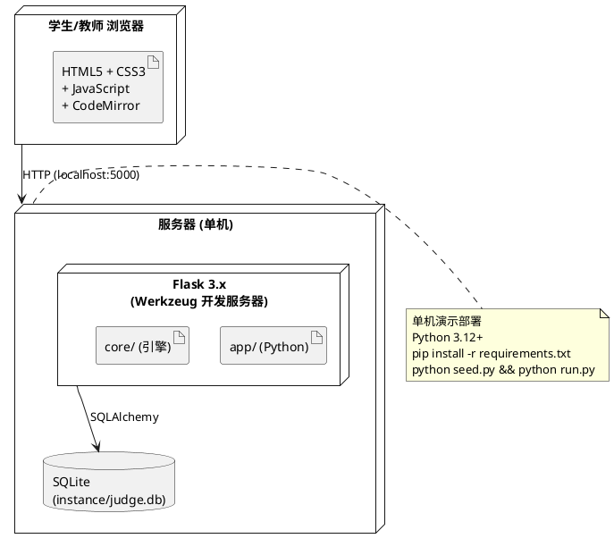

# SortJudge — 系统 UML 建模

> 排序算法学习与评测系统  |  2026-06-16  |  实践周题目二
>
> 所有图提供 PlantUML 源码，可在 [PlantUML Online](https://www.plantuml.com/plantuml/)、VS Code + PlantUML 插件、或 StarUML 中渲染。

---

## 图表索引

| # | 图名 | 类型 | 对应报告章节 |
|---|------|------|------------|
| 1 | 系统用例图 | Use Case | §2 需求分析 |
| 2 | 核心类图 | Class | §3.2 概要设计 |
| 3 | 数据库 ER 图 | Entity-Relationship | §3.3 数据库设计 |
| 4 | 评测顺序图 | Sequence | §4.1 详细设计 |
| 5 | 评测活动图 | Activity | §4.2 详细设计 |
| 6 | 组件架构图 | Component | §3.1 体系结构 |
| 7 | 部署图 | Deployment | §3.1 体系结构 |

---

## 图 1: 系统用例图

```plantuml
@startuml
left to right direction
skinparam packageStyle rectangle

actor "学生" as Student
actor "教师" as Teacher

rectangle "SortJudge 排序评测系统" {
  usecase (UC1 注册/登录) as UC1
  usecase (UC2 浏览题目列表) as UC2
  usecase (UC3 内置IDE编写代码) as UC3
  usecase (UC4 提交评测\n(沙箱执行+算法识别\n+正确性判定)) as UC4
  usecase (UC5 查看评测结果\n与智能反馈) as UC5
  usecase (UC6 观看排序过程\n可视化回放) as UC6
  usecase (UC7 查看提交历史) as UC7
  usecase (UC8 教师建题\n(算法/规则/用例)) as UC8
  usecase (UC9 代码查重) as UC9
  usecase (UC10 复杂度分析) as UC10
}

Student --> UC1
Student --> UC2
Student --> UC3
Student --> UC4
Student --> UC5
Student --> UC6
Student --> UC7

UC3 ..> UC4 : <<include>>
UC4 ..> UC5 : <<include>>
UC4 ..> UC6 : <<extend>>
UC4 ..> UC10 : <<extend>>

Teacher --> UC1
Teacher --> UC8
Teacher --> UC9
Teacher --> UC2

@enduml
```

**说明**：
- `<<include>>`：UC3(编码) 必然触发 UC4(评测)；UC4(评测) 必然产生 UC5(结果)
- `<<extend>>`：UC4(评测) 可选触发 UC6(可视化) 和 UC10(复杂度分析)
- 教师可建题(UC8)、查重(UC9)，也可浏览题目(UC2)

---

## 图 2: 核心类图



**说明**：
- 上半部分：7 张数据表，模型层
- 下半部分：8 个核心引擎，全部纯函数，与 Flask Web 层物理解耦
- SubmissionDetail 关联 SortValidator / StepCollector / FeedbackEngine
- ComplexityEstimator 和 SimilarityDetector 按需触发，不在常规评测链路

---

## 图 3: 数据库 ER 图



**说明**：
- `user` 与 `submission` 一对多：一个学生可多次提交
- `problem` 与 `test_case` 一对多：一道题有多个测试用例
- `submission` 与 `submission_detail` 一对多：一次提交评测多组用例
- `submission_detail` 与 `sort_step` 一对多：一组用例有多步排序快照
- `submission` 与 `complexity_analysis` 一对一（按需触发，0 或 1 条）

---

## 图 4: 评测流程顺序图



**说明**：
- 8 个参与者的完整交互
- 三条分支：超时 / 运行错误 / 正常运行
- 步骤采集始终执行（可视化冗余设计）
- 异常时整体事务回滚（Phase 6 新增）

---

## 图 5: 评测 + 可视化活动图



**说明**：
- 主泳道：评测流程（同步）
- fork：可视化 + 复杂度分析（异步按需）
- break：超时直接终止该提交

---

## 图 6: 组件架构图



**说明**：
- 三层架构：表现层 → 业务层 → 核心引擎层 → 数据层
- 核心引擎层与 Flask 物理解耦（纯 Python 函数，可独立测试）
- 数据层通过 SQLAlchemy ORM 统一访问 SQLite

---

## 图 7: 部署图



**说明**：
- 浏览器端：Bootstrap + CodeMirror + Canvas 动画，无需构建工具
- 服务器：Flask 内置开发服务器（实践周演示），单机部署
- 数据库：SQLite 单文件，零配置
- 部署命令：`pip install -r requirements.txt && python seed.py && python run.py`

---

## 附录：UML 图渲染说明

所有 PlantUML 源码可直接在以下工具中渲染：

| 工具 | 方式 |
|------|------|
| [PlantUML Online](https://www.plantuml.com/plantuml/) | 粘贴源码在线渲染 |
| VS Code + PlantUML 插件 | `Alt+D` 预览 |
| StarUML | 不支持 PlantUML；需手动重建或导出 PNG 贴入 |
| IntelliJ + PlantUML 插件 | 原生支持 |

**使用 PlantUML Online 批量渲染**：
1. 打开 https://www.plantuml.com/plantuml/
2. 将每个 `@startuml ... @enduml` 块分别粘贴
3. 下载 PNG/SVG 插入实验报告
